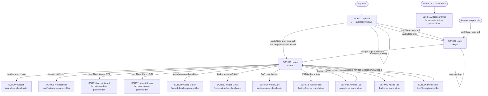

# Screen Flow — SAA 2025 Flutter App

Generated from source. Ground truth: `lib/core/router/app_router.dart`, `lib/features/home/presentation/home_screen.dart`.

---

## Flow Diagram

---

## Navigation Rules (from `app_router.dart` redirect)

| Condition | Current location | Redirect to |
|---|---|---|
| `authState.isLoading` | not `/` | `/` (splash) |
| `authState.isLoading` | `/` | stay (no loop) |
| `authState.hasError` | not `/login` | `/login` |
| `authState.value != null` (logged in) | `/` or `/login` | `/home` |
| `authState.value == null` (not logged in) | any non-login | `/login` |

Router is driven by `ValueNotifier` refreshed on every `authStateProvider` change — all redirects are reactive, not imperative.

---

## Navigation Method per Transition

| From | To | Method | Notes |
|---|---|---|---|
| SCR003 header | SCR007, SCR008 | `context.push(route)` | Back-stack preserved |
| SCR003 hero CTAs | SCR010, SCR011 | `context.push(route)` | Back-stack preserved |
| SCR003 awards card | SCR009 | `context.push(Routes.awardDetail)` | Single detail route (no id param yet) |
| SCR003 kudos CTA | SCR012 | `context.push(route)` | Via `KudosSection.onDetail` callback |
| SCR003 FAB pencil | SCR014 | `_guardedPush(Routes.writeKudo)` | Double-tap guard (`_fabBusy`) |
| SCR003 FAB kudos | SCR013 | `_guardedPush(Routes.kudosFeed)` | Double-tap guard (`_fabBusy`) |
| Shell bottom nav | SCR003–006 | `navigationShell.goBranch(index)` | `StatefulShellRoute` — per-tab state kept |
| Auto-redirect | SCR002→SCR003 | GoRouter redirect | Triggered by `authStateProvider` stream |
| Auto-redirect | SCR003→SCR002 | GoRouter redirect | Triggered by `authStateProvider` null |

---

## Notes

- All standalone placeholder destinations (SCR007–SCR015) sit **outside** the `StatefulShellRoute` — no bottom nav bar rendered.
- Shell tabs (SCR004–SCR006) are inside the shell — `HomeBottomNavBar` always visible.
- `_guardedPush` in `HomeScreen._HomeScreenState` sets `_fabBusy = true` before `await context.push(...)` and resets it when the pushed route pops — prevents duplicate pushes from rapid double-taps.
- No deep-link handling is implemented; all routes use flat path strings from `Routes` constants.
- Award Detail (`/award-detail`) carries no path parameters yet — the card's `id` is not threaded through.
