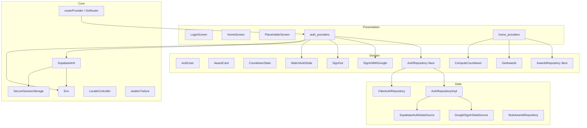

# SAA 2025 — Architecture

## Layer Dependency Rule

```
presentation  →  domain  ←  data
```

- `presentation` depends on `domain` (entities, use-case interfaces, repository contracts).
- `data` depends on `domain` (implements repository interfaces, maps models).
- `domain` has **zero** Flutter / framework imports — plain Dart only.
- `core/` is imported by all layers; it has no feature dependencies.

---

## lib/ Tree

```
lib/
├── main.dart                          # Bootstrap: Env.load → SupabaseInit → ProviderScope → MaterialApp.router
├── core/
│   ├── config/
│   │   ├── env.dart                   # Typed env; --dart-define wins over .env; placeholder detection
│   │   ├── supabase_init.dart         # Tolerant Supabase init; SecureSessionStorage Keychain
│   │   └── secure_session_storage.dart# flutter_secure_storage LocalStorage impl (Keychain iOS)
│   ├── error/
│   │   └── failures.dart              # sealed Failure: AuthCancelled / NetworkFailure / AccountDisabled / UnknownFailure
│   ├── l10n/
│   │   ├── locale_controller.dart     # StateNotifier<Locale>, persisted SharedPreferences, default vi
│   │   └── *.arb                      # vi (default) / en / ja ARB string tables
│   ├── router/
│   │   └── app_router.dart            # routerProvider, Routes constants, StatefulShellRoute, redirect guard
│   └── theme/
│       ├── app_colors.dart            # #00101A bg, #FFEA9E button
│       ├── app_typography.dart        # Montserrat
│       └── app_theme.dart             # AppTheme.dark
├── features/
│   ├── auth/
│   │   ├── domain/
│   │   │   ├── entities/auth_user.dart
│   │   │   ├── repositories/auth_repository.dart      # interface
│   │   │   └── usecases/  sign_in_with_google.dart / sign_out.dart / watch_auth_state.dart
│   │   ├── data/
│   │   │   ├── datasources/  google_sign_in_data_source.dart / supabase_auth_data_source.dart
│   │   │   ├── models/auth_user_model.dart             # fromSupabase factory
│   │   │   ├── repositories/auth_repository_impl.dart  # real impl
│   │   │   └── repositories/fake_auth_repository.dart  # in-memory; tests + demo mode
│   │   └── presentation/
│   │       ├── providers/auth_providers.dart           # authRepositoryProvider, authStateProvider, LoginController
│   │       ├── screens/login_screen.dart
│   │       └── widgets/  google_login_button.dart / language_selector.dart
│   ├── home/
│   │   ├── domain/
│   │   │   ├── entities/  award_card.dart / countdown_state.dart
│   │   │   ├── repositories/  awards_repository.dart / notification_repository.dart / kudos_config_repository.dart
│   │   │   └── usecases/  get_awards.dart / watch_unread_count.dart / get_kudos_availability.dart / compute_countdown.dart
│   │   ├── data/
│   │   │   ├── repositories/  stub_awards_repository.dart / fake_awards_repository.dart /
│   │   │   │                   stub_notification_repository.dart / stub_kudos_config_repository.dart
│   │   │   └── sources/home_mock_data.dart
│   │   └── presentation/
│   │       ├── providers/  home_providers.dart / countdown_controller.dart
│   │       ├── home_screen.dart
│   │       └── widgets/  home_header.dart / hero_countdown.dart / theme_description.dart /
│   │                       awards_carousel.dart / kudos_section.dart / home_fab.dart / home_bottom_nav_bar.dart
│   └── placeholder/
│       └── presentation/placeholder_screen.dart        # "Chưa triển khai" screen
```

---

## Navigation Architecture

**Provider:** `routerProvider` (`lib/core/router/app_router.dart`)

### Structure

```
GoRouter (initialLocation: /)
├── /           → _SplashScreen  (loading spinner; never loops on redirect)
├── /login      → LoginScreen
├── StatefulShellRoute.indexedStack  (4-tab shell, bottom nav)
│   ├── branch 0: /home      → HomeScreen
│   ├── branch 1: /awards    → PlaceholderScreen("Awards")
│   ├── branch 2: /kudos     → PlaceholderScreen("Kudos")
│   └── branch 3: /profile   → PlaceholderScreen("Profile")
└── standalone (no shell / no bottom nav):
    /search / /notifications / /award-detail / /about-award /
    /about-kudos / /kudos-detail / /kudos-feed / /write-kudo / /access-denied
    → PlaceholderScreen each
```

### Auth Redirect Guard

Runs on every navigation event; driven by `authStateProvider` via `refreshListenable`:

| Auth state | Current location | Redirect to |
|---|---|---|
| `isLoading` | any except `/` | `/` (splash) |
| `isLoading` | `/` | none (stay) |
| `hasError` | any except `/login` | `/login` |
| loggedIn | `/` or `/login` | `/home` |
| not loggedIn | any except `/login` | `/login` |

403 (AccountDisabled) is handled in `LoginController` and navigates imperatively to `/access-denied`.

---

## Config / Environment Resolution

`Env` (`lib/core/config/env.dart`) resolves each key via:

```
--dart-define (or --dart-define-from-file)  →  wins
.env file asset (gitignored)                →  fallback
absent / empty                              →  ''
```

Placeholder detection (`_isConfigured`): a value is considered real only if it is non-empty and does **not** start with `your_`, contain `YOUR_`, or contain `replace_with`. This prevents a template `.env` from accidentally activating native Google Sign-In.

**Placeholder fallback path:**

```
SupabaseInit.isInitialized == false
  OR Env.hasGoogleConfig == false
  → authRepositoryProvider returns FakeAuthRepository
     (demo mode: login button works, no native crash)
```

**Config files** (`config/{development,staging,production}.json`): only set `APP_ENV` and `APP_NAME`. Credentials are never committed.

---

## Supabase Initialization

`SupabaseInit.ensureInitialized()` (`lib/core/config/supabase_init.dart`):
- Guards with `Env.hasSupabaseConfig` — skips silently if credentials are absent.
- Passes `SecureSessionStorage` as `localStorage` so the session JWT is stored in Keychain (iOS), not NSUserDefaults.
- Sets `_initialized` flag checked by `authRepositoryProvider`.

`SecureSessionStorage` (`lib/core/config/secure_session_storage.dart`):
- Wraps `flutter_secure_storage` with `KeychainAccessibility.first_unlock`.
- Key: `supabase.session`.

---

## i18n

- Generator: `flutter gen-l10n` (built into Flutter toolchain).
- ARB files under `lib/core/l10n/`. Supported locales: `vi` (default), `en`, `ja`.
- `LocaleController` (`StateNotifier<Locale>`) persists the chosen locale to `SharedPreferences` under key `locale`. Ignores unsupported language codes.
- `SaaApp` reads `localeControllerProvider` and passes to `MaterialApp.router`.

---

## Error Model

```dart
sealed class Failure implements Exception {
  final String? message;   // diagnostic only; never shown raw to users
}

class AuthCancelled    extends Failure  // user dismissed Google sign-in
class NetworkFailure   extends Failure  // SocketException during auth
class AccountDisabled  extends Failure  // Supabase 400/403 (invalid/locked)
class UnknownFailure   extends Failure  // anything else
```

Repositories throw `Failure` subtypes. Presentation layer catches via `AsyncValue.guard` and maps to localized strings.

---

## Component Diagram


